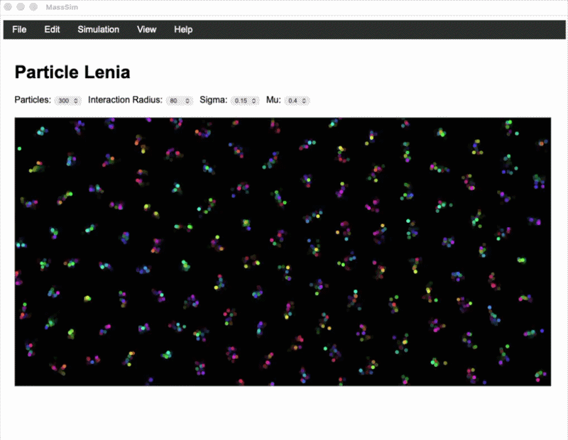
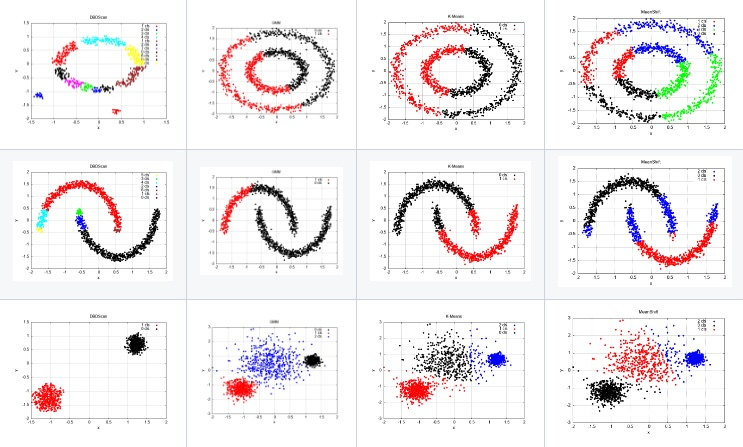
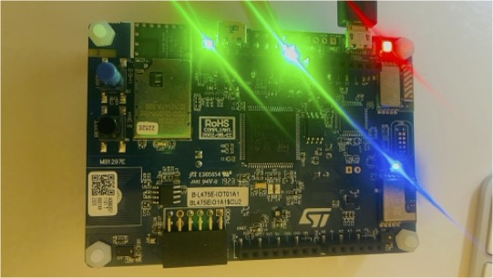

> Software developer skilled in Java, C++, Python and also with Assembly.  Proficient with Data Science and Machine Learning libraries.
> Also skilled with embedded technology development.
>
> <table style="border: none; border-collapse: collapse;">
  <tr>
    <th width="10%"></th>
    <th width="40%"></th>
    <th width="10%"></th>
    <th width="40%"></th>
  </tr>
  <tr>
    <td></td>
    <td><a href="https://github.com/deepak-shenoy/libtorch-ltsm-airport-passenger-forecasting">Time Series Forecasting: Airport passenger trends</a></td>
    <td></td>
    <td><a href="https://github.com/deepak-shenoy/mass-simulator">Mass Simulator</a></td>
  </tr>
  <tr>
    <td></td>
    <td><a href="https://github.com/deepak-shenoy/clustering-templates">Data clustering templates</a></td>
  </tr>
  <tr>
    <td></td>
    <td>
        <a href="https://github.com/deepak-shenoy/iot-interfaces">IoT Interfaces</a> 
        <a href="https://github.com/deepak-shenoy/robot-mini-rover-vehicle-kit">Robot Vehicle</a>
    </td>
  </tr>
  <tr>
    <td></td>
    <td>
        <a href="https://github.com/deepak-shenoy/lcd-template-v1">IoT Interfacing with a LCD Screen</a>
    </td>
  </tr>
</table>

---